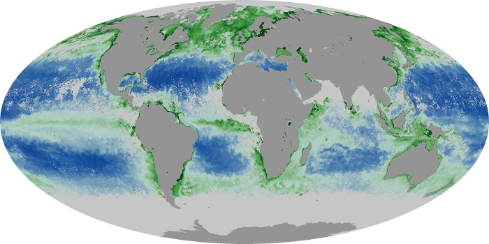

<h1>
Bayesian Chlorophyll Project
</h1>

    The purpose of this project is to compare various models predicting chlorophyll (hereafter _Chla_) using the well established Bayesian inference framework in conjunction with principles of Information Theory. All models examine here make use, in one form or another, of remote sensing reflectance (_Rrs_) at 443, 490, 510, 555 nm. These models include:
    <itemize>
        <item> NASA's "empirical $OC_4$, a polynomial regression model where the input is 
        <item> Multivariate linear regression, where Rrs at multiple bands are inputs
        <item> Simple linear model similar to $OC_4$ but where the MBR input is left at order 1.
        <item> Hiearchical partially pooled model with base formulation similar to that of the above but where the impact of grouping by blue band used in the ratio is taken to account.
        <item> Multivariate linear model where the inputs are the eigenvectors resulting from a Principle Components Analysis of the Rrs bands.
            
    </itemize>

